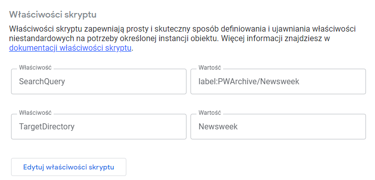

<!--Category:PowerShell--> 
 

    <a href="http://productivitytools.tech/backup-bookmarks-chrome/"><a> 
    

    

# GmailAttachement2Drive

Script saves gmail attachement to the GDrive.

<!--more-->

To make it work:
 - apply a rule in the gmail and apply a label to the email
 - run the function
    - function will iterate through the query result
    - function will save attachement in the given direcotry
    - function will save reply email

